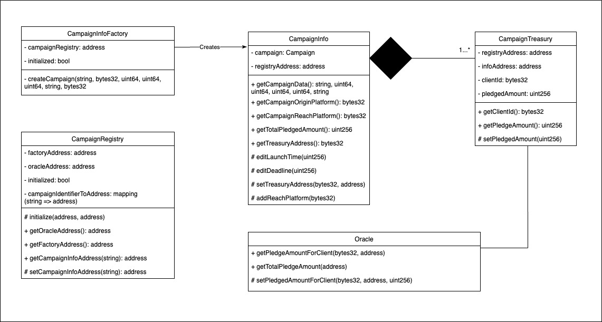

# multilisting-contracts

##  🔧 Setting up Local Development
Required: 
- [Node v14](https://nodejs.org/download/release/latest-v14.x/)  
- [Git](https://git-scm.com/downloads)

Local Setup Steps:
1. git clone https://github.com/ccprotocol/multilisting-contracts.git
1. Install dependencies: `npm install` 
    - Installs [Hardhat](https://hardhat.org/getting-started/) & [OpenZeppelin](https://docs.openzeppelin.com/contracts/4.x/) dependencies
1. Compile Solidity: `npx hardhat compile`

## 💻 Deployment steps

Deploy base contracts:
`npx hardhat run scripts/deploy.ts`

Deploy and test for multilisting: 
`npx hardhat run scripts/deployCampaign.ts`

## 🤨 How it all works

